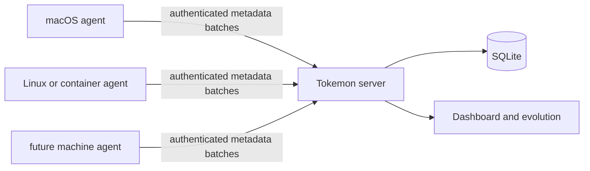

# Tokemon multi-machine deployment roadmap

**Status:** v0.2 rollout plan
**Last updated:** 2026-07-13

This document is the implementation roadmap for running one Tokemon server with agents on multiple machines. Linear remains the source of truth for committed work; this document defines the architecture, rollout order, and operational checks rather than creating a second backlog.

Current slice status: the shared agent config loader, macOS server/agent LaunchAgent installers, Claude Code adapter, and durable agent state are implemented and covered by tests. A second Apple Silicon Mac is installed and syncing through the primary Mac's persistent authenticated hub. Live provider validation, release publishing, and the Linux container template remain ahead.

## Topology and roles



| Role | Responsibility | Initial placement |
| --- | --- | --- |
| Server | Authenticated ingestion, SQLite, analytics, dashboard, evolution | Primary Mac, then a stable Linux host if needed |
| Agent | Read local provider metadata, normalize, upload, retain local cursor state | Primary Mac and the second Mac already deployed |
| Endpoint | One private base URL reachable by every trusted machine | Tailscale/WireGuard address or HTTPS hostname |

Agents are outbound-only. The server is the only component that needs a reachable listening port. A machine is enrolled by installing the same binary, writing the endpoint and token to its local config, and starting its platform supervisor.

## Roadmap at a glance

| Phase | State | Outcome | Linear work |
| --- | --- | --- | --- |
| 0. First multi-machine slice | Validated | Authenticated server endpoint and second macOS agent sync real metadata | CAR-63, CAR-64, CAR-65 |
| 1. Durable hub | Implemented | Server survives LaunchAgent restart with protected config, WAL-backed SQLite, and health checks | macOS deployment slice |
| 2. Failure-safe agents | Implemented | Cursors, retries, rotation, and local state obey the v0.2 contract | CAR-65 |
| 3. Provider evidence | Planned | Live Claude fixture plus complete Codex/OpenCode fixture and inspect coverage | CAR-63, CAR-64 |
| 4. Release gate | Planned | Cross-provider privacy, authentication, idempotency, and two-machine tests pass | CAR-67 |
| 5. Distribution | Planned | Signed macOS archive/Homebrew path and Linux multi-architecture image/service templates | Deployment follow-up |
| 6. Product finish | In progress | Counter-first analytics and evolution-art release acceptance | CAR-69, CAR-66 |

The immediate implementation order is Phase 3, Phase 4, and Phase 5. Distribution follows once the provider evidence and release gate are trustworthy; adding more platforms before that would multiply support paths around an unstable adapter surface.

## Decision

Use one Go binary and one normalized event contract, with a platform-appropriate supervisor:

| Platform | Distribution | Supervisor | Default source access |
| --- | --- | --- | --- |
| macOS | Homebrew or signed release archive | user LaunchAgent | `~/.claude/projects`, `~/.codex`, `~/.copilot/session-state`, OpenCode data, `~/.gemini/antigravity-cli/conversations` |
| Linux | Docker/Podman image | Compose, Quadlet, or systemd | `~/.claude/projects`, `~/.codex`, `~/.copilot/session-state`, OpenCode data, `~/.gemini/antigravity-cli/conversations` |
| Minimal/managed hosts | signed release archive | systemd or an existing orchestrator | explicit configured paths |

The server remains a separate deployment from the agents. It owns SQLite, ingestion authentication, analytics, and the dashboard. An agent only reads local usage metadata and makes outbound requests.

## Endpoint and configuration contract

The agent is configured with the server **base URL**, not the API route:

```text
TOKEMON_SERVER_URL=https://tokemon.example.ts.net
```

The agent posts normalized batches to:

```text
${TOKEMON_SERVER_URL}/api/v1/events/batch
```

The shared v0.2 ingest credential is configured separately:

```text
TOKEMON_INGEST_TOKEN=replace-with-a-generated-secret
```

The canonical file for managed installs is:

```text
~/.config/tokemon/agent.env
```

The final configuration surface is:

```env
TOKEMON_SERVER_URL=https://tokemon.example.ts.net
TOKEMON_INGEST_TOKEN=...
TOKEMON_MACHINE_ID=mac-mini
TOKEMON_SCAN_INTERVAL=1m
TOKEMON_HOME=/Users/example
TOKEMON_STATE=/Users/example/.local/share/tokemon/state.db
```

Resolution order is explicit flags, environment variables, the config file, then safe defaults. Secrets must not be placed in process arguments or container image layers. Config files containing tokens are user-readable only (`0600`).

The agent supports `--config`, `--server`, `--token`, `--machine-id`, `--interval`, `--home`, and `--state`, plus the corresponding `TOKEMON_*` environment variables. The macOS installer writes this file and launches the service with `--config`. If no state path is supplied, the agent uses `~/.local/share/tokemon/state.db`.

## Machine onboarding flow

Every new machine follows the same sequence:

1. Confirm the server is healthy on the private endpoint.
2. Generate or retrieve the deployment ingest token through a protected channel.
3. Install a matching Tokemon binary for the machine architecture.
4. Write `TOKEMON_SERVER_URL`, `TOKEMON_INGEST_TOKEN`, and `TOKEMON_MACHINE_ID` to the local mode-0600 config.
5. Start the native supervisor or container with the local provider paths mounted read-only.
6. Verify one authenticated sync, then verify that the next sync refreshes rather than duplicates events.
7. Confirm the new machine appears in the dashboard with a recent heartbeat.

The server endpoint and token are the only shared deployment inputs. Provider paths, machine IDs, local state, and supervisor configuration remain machine-local.

## Phase 1: make the hub durable

The primary Mac now runs the hub as a user-level server LaunchAgent with:

- a protected server env file containing the database path and ingest token;
- `RunAtLoad` and `KeepAlive` behavior;
- a stable SQLite path outside temporary build output;
- stdout/stderr logs under `~/Library/Logs/Tokemon`;
- a `/healthz` check after boot and after restart;
- Tailscale/WireGuard or HTTPS-only reachability from enrolled agents.

The installed service uses `tokemon serve --config ~/.config/tokemon/server.env`, preserves the existing SQLite database, enables SQLite WAL mode with a busy timeout for concurrent agent uploads, and keeps the token out of LaunchAgent arguments. The server process is the only writer; stop it before using restore or repair tooling. This keeps the current no-Docker macOS path while removing the session-lifetime failure mode. The server remains a single hub; agents do not become peer servers.

## Phase 2: make agents failure-safe

The agent now implements the v0.2 local state contract in `~/.local/share/tokemon/state.db`. State contains only source identity, cursor, machine ID, last successful sync, and hashes of normalized event snapshots so aggregate adapters can remain delta-only across restarts.

The agent must:

- read only new records from each source;
- advance a cursor only after the server accepts the batch;
- retain the cursor and retry after a failed upload;
- detect truncation, replacement, missing files, and rotation;
- resume safely after a process or machine restart;
- rely on deterministic event IDs to make rescans idempotent.

File and append-only sources advance their cursors incrementally, including safe one-line context lookback for Claude duration metadata. Database-backed and context-dependent snapshot adapters rescan local metadata as needed, but persistent event fingerprints prevent unchanged snapshots from being uploaded again. Failed uploads leave both cursors and fingerprints uncommitted; replacement, truncation, and rotation reset file cursors safely. This is the core of CAR-65 and is the boundary between a useful demo and a trustworthy multi-machine counter.

## Phase 3: prove provider coverage

Complete the adapters against representative fixtures, then validate one real Claude Code transcript without retaining its content. The evidence set should cover:

- Claude Code assistant usage records, cache fields, duration when present, and unknown values;
- Codex, GitHub Copilot CLI, and OpenCode model aliases, token fields, sessions, and source discovery;
- exact `inspect` output for each provider;
- assertions that prompts, responses, titles, repository paths, and source code never enter outgoing events.

Synthetic fixtures remain useful for deterministic tests, but one live Claude capture is needed to catch format drift before release.

## Phase 4: release gate

CAR-67 should exercise the complete path on at least two machines:

```text
provider files → local adapter → agent state → authenticated batch API → SQLite → dashboard
```

The release gate passes only when it verifies authentication failure, retry without cursor advancement, rotation, duplicate refresh, restart recovery, privacy redaction, machine attribution, and correct evolution totals.

## macOS first

The first supported install path is a user-level LaunchAgent. It does not require root or Docker. The primary Mac uses `deploy/macos/install-server.sh` for the hub; every other Mac uses `deploy/macos/install-agent.sh` for an outbound-only agent.

The server uses `tokemon serve --config ~/.config/tokemon/server.env`, while agents use `tokemon agent --config ~/.config/tokemon/agent.env`. Both config files are parsed as data-only dotenv files and are mode `0600`.

Target layout:

```text
~/.local/bin/tokemon
~/.config/tokemon/agent.env       # mode 0600
~/.config/tokemon/server.env      # mode 0600 on the hub
~/Library/LaunchAgents/com.tokemon.agent.plist
~/Library/LaunchAgents/com.tokemon.server.plist
~/Library/Logs/Tokemon/agent.log
~/Library/Logs/Tokemon/server.log
```

The installer will:

1. Detect Apple Silicon versus Intel.
2. Install or update the signed Tokemon binary through Homebrew or a release archive.
3. Write the endpoint and token configuration.
4. Generate a user LaunchAgent with `RunAtLoad` and a one-minute interval.
5. Load the service with `launchctl` and run one immediate sync.
6. Report the service state and the server response.

The launchd process runs as the logged-in user, reads provider databases read-only, and writes only its own logs. It will not recursively scan the home directory.

## Linux and container path

Publish one multi-architecture OCI image, initially `linux/amd64` and `linux/arm64`. The image uses the existing `tokemon agent` command; a separate agent codebase is unnecessary.

The Compose template will:

- use `restart: unless-stopped`;
- run as the host user's UID/GID where practical;
- use a read-only root filesystem;
- drop Linux capabilities and set `no-new-privileges`;
- mount only explicit provider paths read-only;
- accept `TOKEMON_INGEST_TOKEN` from the deployment environment rather than an image layer;
- expose no inbound agent port;
- avoid host networking and the Docker socket because Tokemon does not collect host metrics.

The initial Linux mounts are:

```text
${HOME}/.claude/projects     → /agent-home/.claude/projects:ro
${HOME}/.codex               → /agent-home/.codex:ro
${HOME}/.copilot/session-state → /agent-home/.copilot/session-state:ro
${HOME}/.local/share/opencode → /agent-home/.local/share/opencode:ro
```

The server can be kept running as a detached Compose service from the repository
root:

```bash
docker compose --env-file .env -f deploy/docker-compose.yml up -d --build
docker compose --env-file .env -f deploy/docker-compose.yml ps
curl http://127.0.0.1:18787/healthz
```

The service restarts unless explicitly stopped, and SQLite persists in
`./data/tokemon.db`. The default host port is `18787` and binds all host
interfaces for private-network access; the container still listens on 8080
internally. Set `TOKEMON_PORT` to change it, and set the required
`TOKEMON_INGEST_TOKEN` in a local `.env` file or deployment environment. Keep
the port behind Tailscale, a VPN, or an authenticated reverse proxy; the
dashboard itself has no user login. Deploying a new build on request is the
same `up -d --build` command; stop it with
`docker compose --env-file .env -f deploy/docker-compose.yml down`.

The Compose service keeps its root filesystem read-only and provides a bounded,
non-executable `/tmp` tmpfs for SQLite's transient query work. Persistent data
remains under `./data` only.

Before applying a newer SQLite schema version, Tokemon runs an integrity check
and creates a consistent snapshot with SQLite's `VACUUM INTO`. Compose installs
store these snapshots under `./data/backups/`; filenames record the previous
and target schema versions. Tokemon retains the newest ten snapshots and does
not create another backup on ordinary restarts at the same schema version. To
restore, stop the server, preserve the current database separately, copy the
selected snapshot to `./data/tokemon.db`, and start the server so migrations can
run again. Never restore over a running server.

The agent runs with `--home /agent-home`, so provider discovery stays identical inside and outside the container. A read-only mount limits mutation, not visibility; a compromised container could still read mounted files. The explicit mount allowlist and metadata-only parser are therefore both required.

Standalone binaries plus systemd are the fallback for machines without Docker or
Podman. The repository includes a user-level unit at
`deploy/linux/tokemon-agent.service`. Install the matching binary at
`~/.local/bin/tokemon`, write the mode-0600 `~/.config/tokemon/agent.env` using
the endpoint contract above, then run:

```bash
install -d -m 700 ~/.config/tokemon ~/.local/share/tokemon
install -m 644 deploy/linux/tokemon-agent.service \
  ~/.config/systemd/user/tokemon-agent.service
systemctl --user daemon-reload
systemctl --user enable --now tokemon-agent.service
systemctl --user status tokemon-agent.service
```

The unit has no inbound listener, uses the user-owned state directory, and
restarts after transient failures. Enable user lingering when the agent must
run without an interactive login:

```bash
loginctl enable-linger "$USER"
```

Ansible can install either path across a fleet later.

## Claude Code integration

Claude Code usage is stored in session JSONL files under:

```text
~/.claude/projects/<encoded-project>/<session-id>.jsonl
```

The adapter streams those files and inspects assistant records containing `message.usage`, plus the metadata-only `system` / `turn_duration` record that Claude Code writes after a turn. It extracts:

- timestamp;
- session ID;
- model;
- input tokens;
- output tokens;
- cache-read tokens;
- cache-creation/write tokens.
- turn duration in milliseconds when present.

It will not send message content, tool content, project names, encoded project paths, titles, or repository paths. File identity is hashed before it participates in an event ID or source identity. Missing token fields remain unknown; totals are derived only when the required components are present.

Each assistant API response becomes one deterministic usage event. Stable identity is based on the hashed transcript identity, line offset, timestamp, and session ID. This permits rescans without duplicate lifetime totals while the durable cursor state is completed.

The adapter is covered by synthetic privacy fixtures and an exact normalized-payload test. Its record and usage-field shapes were also checked against live Claude Code transcripts on an enrolled machine without retaining or displaying conversation content, titles, working directories, or source paths.

## GitHub Copilot CLI integration

GitHub Copilot CLI usage is stored in durable session event streams under:

```text
~/.copilot/session-state/<session-id>/events.jsonl
```

The adapter reads only the `session.shutdown` event's per-model `modelMetrics.usage` aggregate and the metadata-only session context needed to normalize a project basename. It emits one stable usage snapshot per model and session, preserving input, output, cache-read, cache-write, and reasoning token fields when reported. It does not read or send prompts, responses, tool arguments, titles, repository paths, or modified-file lists. Active sessions are picked up after Copilot writes their durable shutdown aggregate.

## Security baseline

- Keep ingestion behind Tailscale/WireGuard or HTTPS; do not expose the raw HTTP port publicly.
- Require `TOKEMON_INGEST_TOKEN` on any multi-machine server. Do not deploy with `change-me`.
- Prefer one token per trusted deployment until per-agent credentials and revocation exist.
- Store tokens in `0600` files or the platform secret store; do not put them in command lines, images, or Git.
- Keep agents outbound-only. No inbound agent listener is required.
- Run native agents as the user and containers as non-root.
- Open provider data read-only and mount only known paths.
- Keep `inspect` and export behavior privacy-verifiable.
- Pin release checksums and container image digests for managed deployments.

## Verification gates

Every deployment path must verify:

1. The supervisor reports the agent running.
2. The agent can reach the configured server endpoint.
3. The server accepts a valid token and rejects an invalid one.
4. A second sync refreshes existing snapshots instead of adding duplicates.
5. The dashboard attributes usage to the new machine.
6. A captured normalized payload contains no prompt, response, title, source-code, or repository-path content.
7. The agent survives a restart and retries when the server is temporarily unavailable.

## Distribution after the release gate

Once the two-machine release gate passes:

1. Publish signed macOS arm64 and amd64 archives, then add the Homebrew formula.
2. Publish a multi-architecture OCI image for `linux/amd64` and `linux/arm64`.
3. Add a Compose template with explicit read-only provider mounts and a non-root runtime.
4. Add systemd/Quadlet instructions for Linux hosts that do not use Docker or Podman.
5. Add Ansible or another fleet wrapper only after the native and container contracts are stable.

The Mac path remains native and Docker-free. Containers are a Linux distribution option, not a requirement for small agents.

Relevant committed work is tracked in the Tokemon v0.2 Linear milestone: CAR-63, CAR-64, CAR-65, CAR-66, CAR-67, CAR-68, and CAR-69. Distribution work is intentionally sequenced after the reliability and release gates so every platform shares one tested agent contract.
