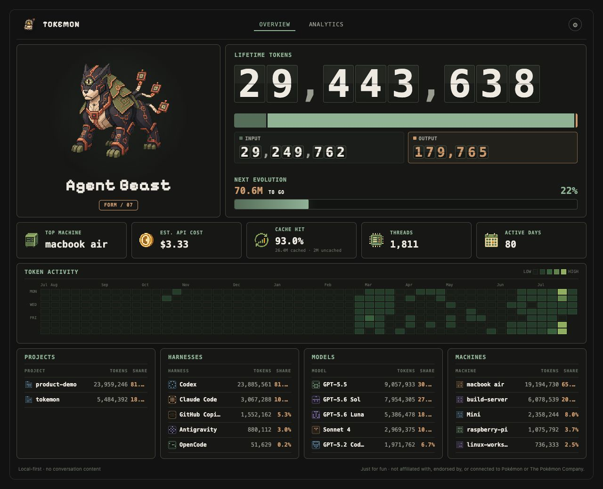

# Tokemon


> A local-first token garden for your coding agents.

Tokemon turns usage metadata into a small evolving creature and a calm dashboard for seeing where your tokens go. It runs locally, keeps its data in SQLite, and can collect from more than one machine.

Privacy is the point: Tokemon stores usage metadata only. It does not collect prompts, responses, source code, conversation titles, or full repository paths by default.

Tokemon is an independent project made just for fun and is not affiliated with, endorsed by, or connected to Pokémon or The Pokémon Company.



## Supported providers

Claude Code · Codex · GitHub Copilot CLI · OpenCode · Antigravity · OpenClaw · Hermes Agent

Tools without a native provider can use Tokemon's generic event import path.

## Run locally

Requires Go 1.26+.

Start the dashboard:

```bash
go run ./cmd/tokemon serve --database ./data/tokemon.db
```

Open [localhost:8080](http://localhost:8080), then sync the current machine once:

```bash
go run ./cmd/tokemon agent --server http://127.0.0.1:8080 --once
```

Leave off `--once` to keep the agent polling. Set `TOKEMON_INGEST_TOKEN` before exposing the ingest endpoint beyond a trusted local network.

The overview shows lifetime tokens, token mix, a 53-week activity field, and breakdowns by project, provider, model, and machine. Open `/analytics` for trends, comparisons, filters, and export.

## Deploy with Docker Compose

Compose runs Tokemon as a persistent dashboard hub with SQLite data stored under `./data`.

From the repository root:

```bash
export TOKEMON_INGEST_TOKEN="$(openssl rand -hex 32)"
export TOKEMON_UID="$(id -u)"
export TOKEMON_GID="$(id -g)"

docker compose -f deploy/docker-compose.yml up -d --build
curl --fail http://localhost:18787/healthz
```

Then open [localhost:18787](http://localhost:18787). To follow logs or stop the hub:

```bash
docker compose -f deploy/docker-compose.yml logs -f tokemon
docker compose -f deploy/docker-compose.yml down
```

The default port is `18787`; set `TOKEMON_PORT` to change it. Keep the port on a private network such as Tailscale or a VPN because the dashboard does not provide user login. See the [public deployment guide](DEPLOYMENT.md) for multi-machine agents, macOS supervisors, and release installation.

## Roadmap

- **Current:** reliable multi-machine collection, metadata-only privacy, analytics, and the evolving Tokemon dashboard.
- **Next:** broader provider fixtures, release verification, and a smoother install path.
- **Later:** signed macOS and Linux distribution, more providers, and deeper evolution art.

## Develop

```bash
go test ./...
go run ./cmd/tokemon catalog validate --catalog catalog/models.yaml
```

Run `go run ./cmd/tokemon --help` for the full command list.

## Documentation

- [v0.2 product spec](https://github.com/carteakey/tokemon/blob/main/docs/tokemon-spec-v0.2.md)
- [Historical token-bandit spec](https://github.com/carteakey/tokemon/blob/main/docs/token-bandit-spec.md)
- [Visual style guide](https://github.com/carteakey/tokemon/blob/main/STYLE_GUIDE.md)
- [Changelog](CHANGELOG.md)

## License

Tokemon is released under the [MIT License](LICENSE).
